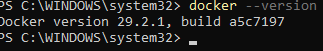
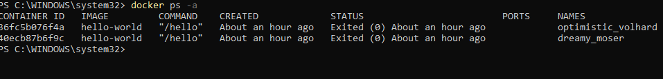
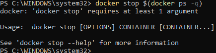
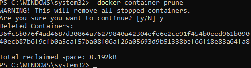
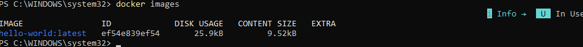
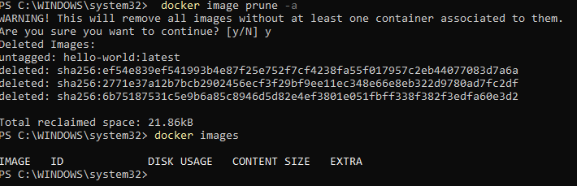

## Команды для Docker важные и не очень

1. docker --version - Данные о версии докера.

2. docker ps -a - это какие контейнеры открыты вами.

3. docker stop (docker ps -q) - Останавливает работу контейнера

4.  docker container prune - удаляет образы

5. docker images - показывает все имеющиейся контейнеры

6. docker image prune -a - удаляет все образы и контейнеры
