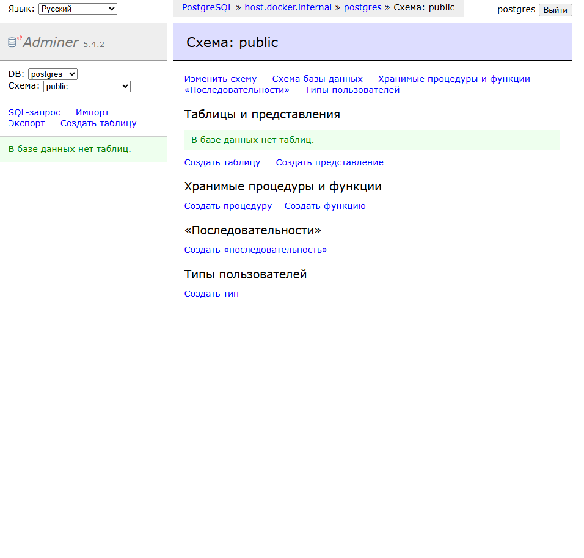

# Отчет: Использование Adminer для управления БД

## 1. Запуск контейнера
Инструмент Adminer запущен на порту 8084:
`docker run -d --name adminer -p 8084:8080 adminer:latest`

## 2. Подключение к СУБД
Для связи с ранее запущенным контейнером PostgreSQL использовались следующие параметры:
- **Движок:** PostgreSQL
- **Сервер:** host.docker.internal
- **Пользователь:** postgres

### Интерфейс Adminer после авторизации:

## 3. Вывод
Adminer успешно развернут и подключен к базе данных PostgreSQL. Использование `host.docker.internal` позволило установить связь между независимыми контейнерами через хост-систему.