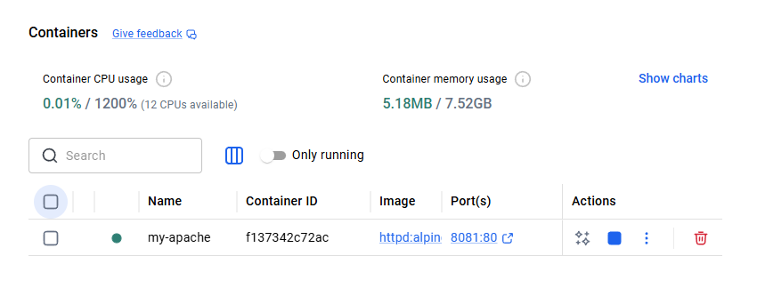
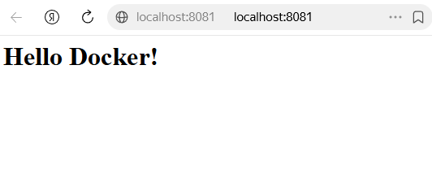

# Самостоятельная работа по созданию контейнеров из готовых образов

## Задача:
Развернуть контейнер из готового образа `httpd:alpine` и подключить локальную папку с проектом.

## Выполнение:
1. Был использован официальный легковесный образ Apache.
2. Контейнер запущен командой:
   `docker run -d --name my-apache -p 8081:80 -v ${PWD}:/usr/local/apache2/htdocs httpd:alpine`

## Результаты:
Контейнер успешно запущен и работает. Локальные файлы синхронизированы с директорией сервера.

### Скриншот работающего контейнера в Docker:

### Скриншот страницы в браузере:
