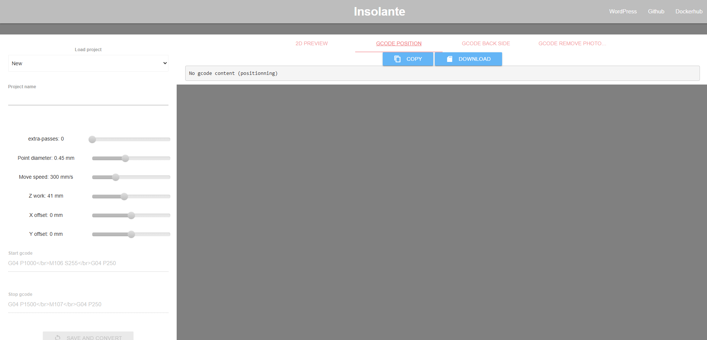

# Отчет: Развертывание веб-оболочки Pcb2gcode (Insolante)

## 1. Запуск контейнера
Для работы приложения была создана локальная директория `C:\insolante_data` и выполнен запуск контейнера на порту 8081:
`docker run --rm -p 8081:5000 -d -e URL=http://localhost -e RPORT=8180 -e DEBUG=false -v C:\insolante_data:/opt/core/data ngargaud/insolante`

## 2. Интерфейс приложения
Приложение предоставляет веб-интерфейс для генерации G-кода из Gerber-файлов, используемых при производстве печатных плат.

### Главный экран управления проектами:

## 3. Вывод
Инструмент успешно развернут. Настроена связь с хост-системой через volume для сохранения созданных проектов. Веб-интерфейс доступен и функционирует корректно.