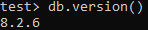
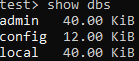
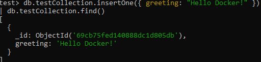

# Отчет: Развертывание NoSQL базы данных MongoDB

## 1. Запуск контейнера
Контейнер запущен на стандартном порту 27017:
`docker run -d --name my-mongo -p 27017:27017 mongo:latest`

## 2. Проверка работы через mongosh

### Версия MongoDB:

### Список доступных БД:

### Вызов команды hello-world

## 3. Вывод
База данных MongoDB успешно развернута. Проверка через встроенный shell подтвердила корректную работу движка и возможность выполнения операций записи/чтения.