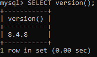
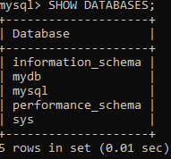

# Отчет: Развертывание и проверка MySQL в Docker

## 1. Запуск контейнера
Контейнер запущен с пробросом порта 3306 и созданием базы данных `mydb`:
`docker run -d --name my-mysql -p 3306:3306 -e MYSQL_ROOT_PASSWORD=rootpassword -e MYSQL_DATABASE=mydb -e MYSQL_USER=user -e MYSQL_PASSWORD=password mysql:8`

## 2. Проверка работы (SQL запросы)

### Версия сервера:

### Список баз данных:

## 3. Вывод
СУБД MySQL успешно развернута. Доступ к базе данных по протоколу TCP/IP (порт 3306) открыт, авторизация проходит успешно.