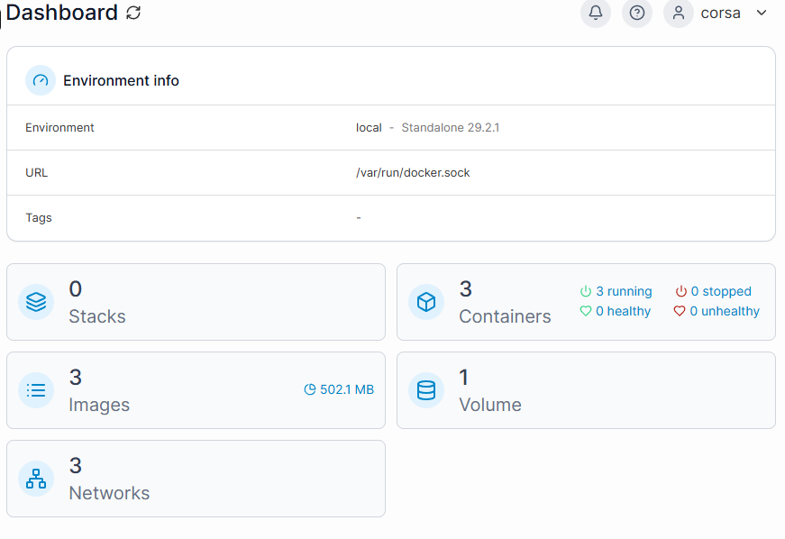
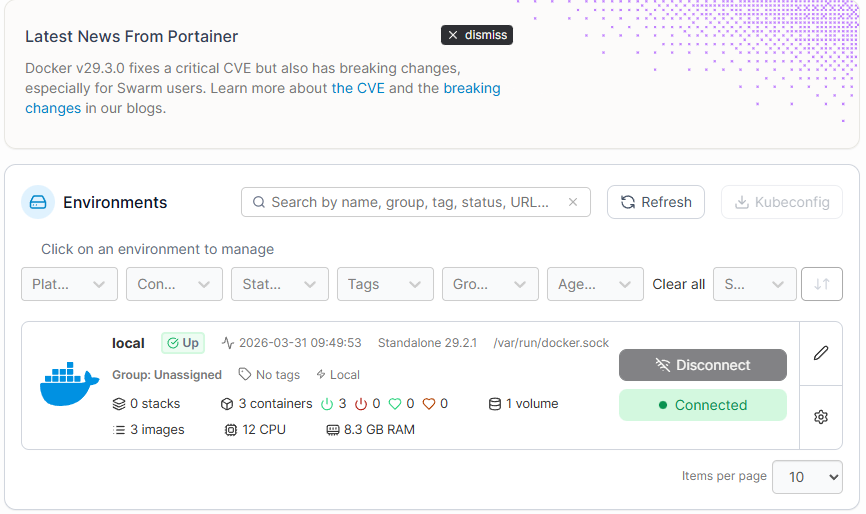

# Отчет: Развертывание Portainer

## 1. Команда запуска
Для запуска Portainer с сохранением данных (volumes) использовалась команда:
```powershell
docker run -d --name portainer -p 9000:9000 -p 9443:9443 -v /var/run/docker.sock:/var/run/docker.sock -v portainer_data:/data --restart unless-stopped portainer/portainer-ce:latest
```

