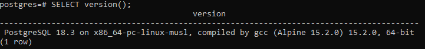
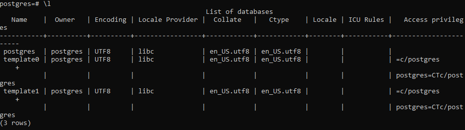

# Отчет: Развертывание PostgreSQL в Docker

## 1. Запуск контейнера
Для запуска использовался официальный образ `postgres:alpine` с пробросом порта 5432:
`docker run -d --name my-postgres -p 5432:5432 -e POSTGRES_PASSWORD=mysecretpassword postgres:alpine`

## 2. Проверка работы через psql

### Версия СУБД:

### Список баз данных:

## 3. Вывод
Контейнер с PostgreSQL успешно запущен. Проверка через внутреннюю утилиту `psql` подтвердила работоспособность сервера и доступность системных баз данных.