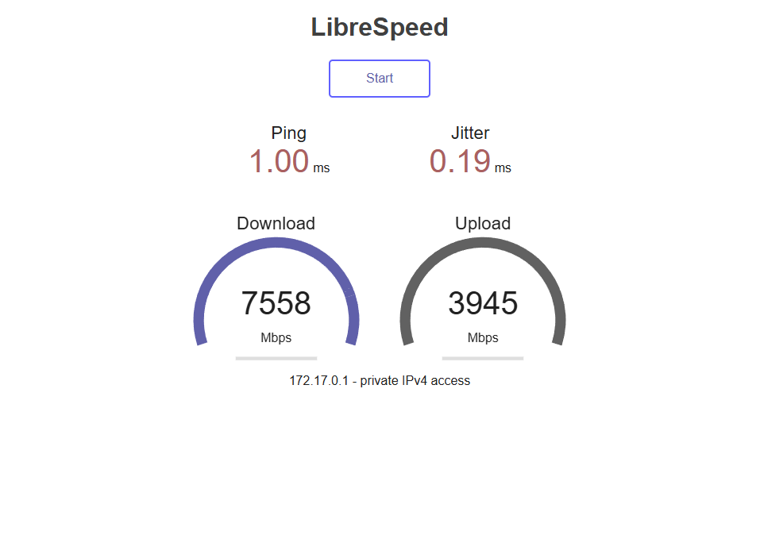

# Отчет: Тестирование скорости (Speedtest в Docker)

## 1. Запуск контейнера
Для развертывания локального сервера Speedtest использовалась команда:
`docker run -d -p 158:80 --name speedtest-server adolfintel/speedtest`

## 2. Результаты тестирования
Замер произведен через веб-интерфейс на порту 158.

## 3. Вывод
Контейнер успешно развернут, проброс порта 158:80 настроен корректно. Интерфейс доступен локально.