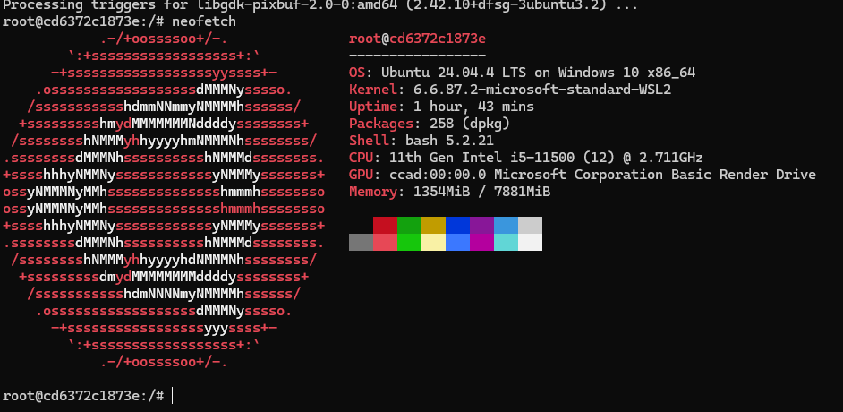
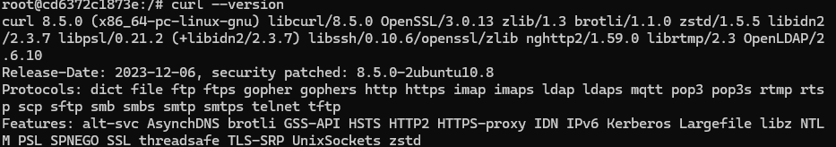

# Отчет: Тестирование временного контейнера Ubuntu

## 1. Запуск системы
Использовался официальный образ Ubuntu с флагом автоматического удаления после завершения сессии:
`docker run -it --rm ubuntu:latest /bin/bash`

## 2. Установка ПО и проверка
Внутри контейнера была обновлена база пакетов и установлена утилита `neofetch`.

### Результат выполнения neofetch:

### Проверка curl:

## 3. Вывод
Контейнер успешно отработал в интерактивном режиме. Флаг `--rm` обеспечил автоматическую очистку ресурсов после выхода из консоли bash.