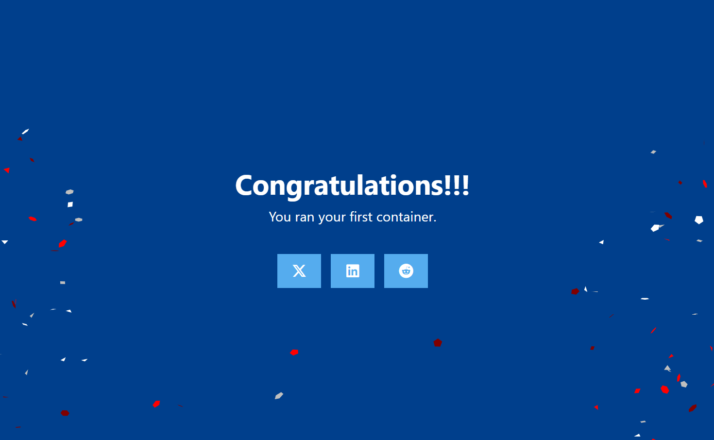
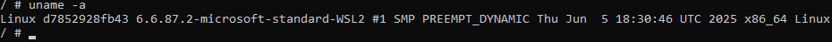
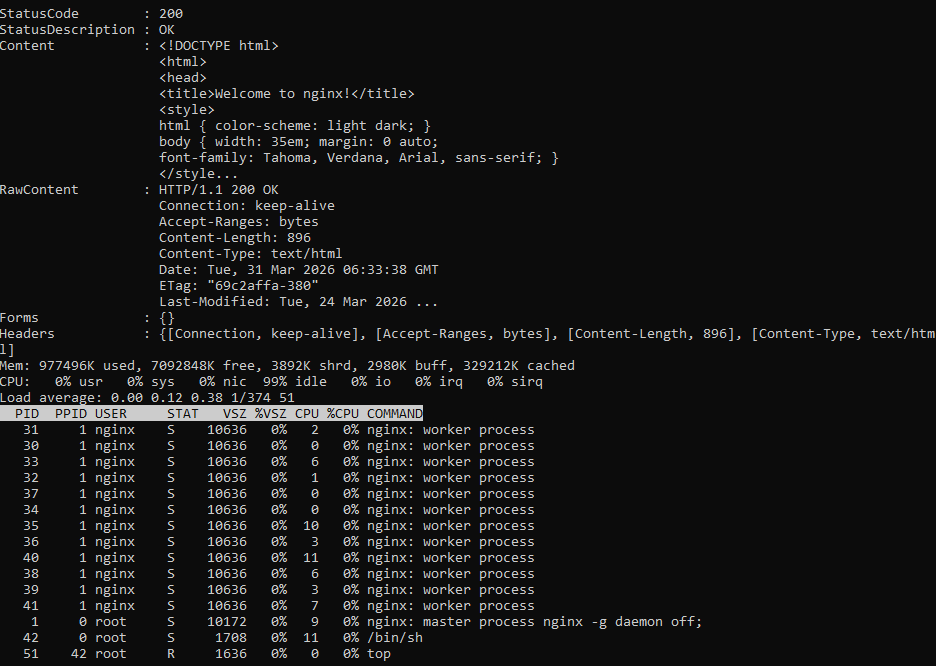
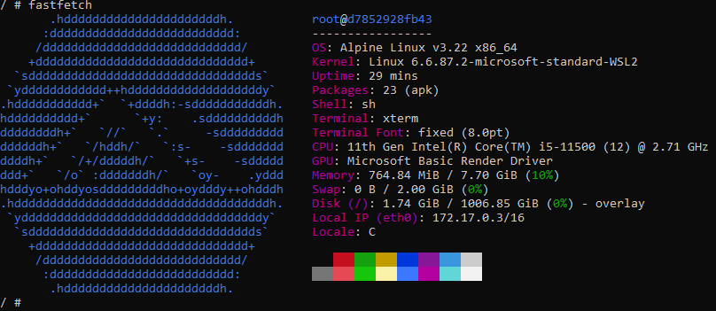

# Отчет по работе с Docker: Welcome to Docker

## 1. Запуск контейнера
Контейнер был запущен командой:
`docker run -d -p 8088:80 --name welcome-to-docker docker/welcome-to-docker`

## 2. Работа внутри контейнера
Был выполнен вход в контейнер и установлена утилита `fastfetch`.

### Информация о системе (uname):

### Диспетчер процессов (top):

### Результат работы fastfetch:
