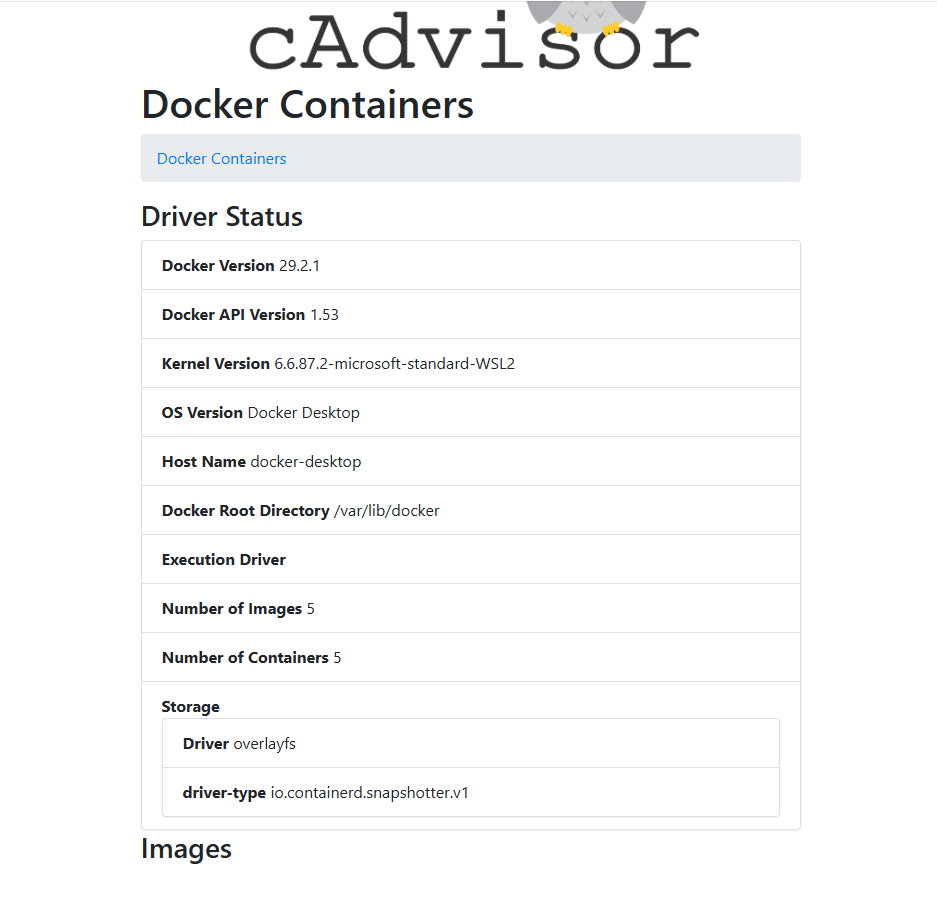
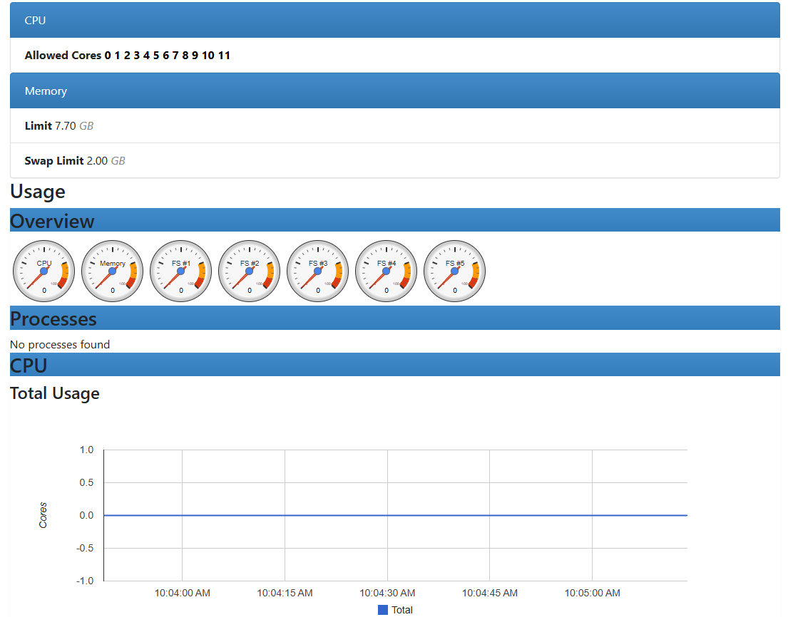
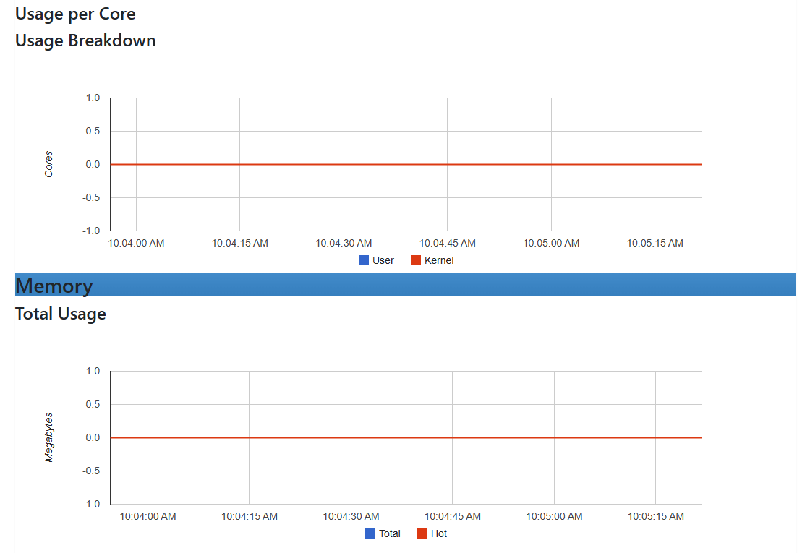
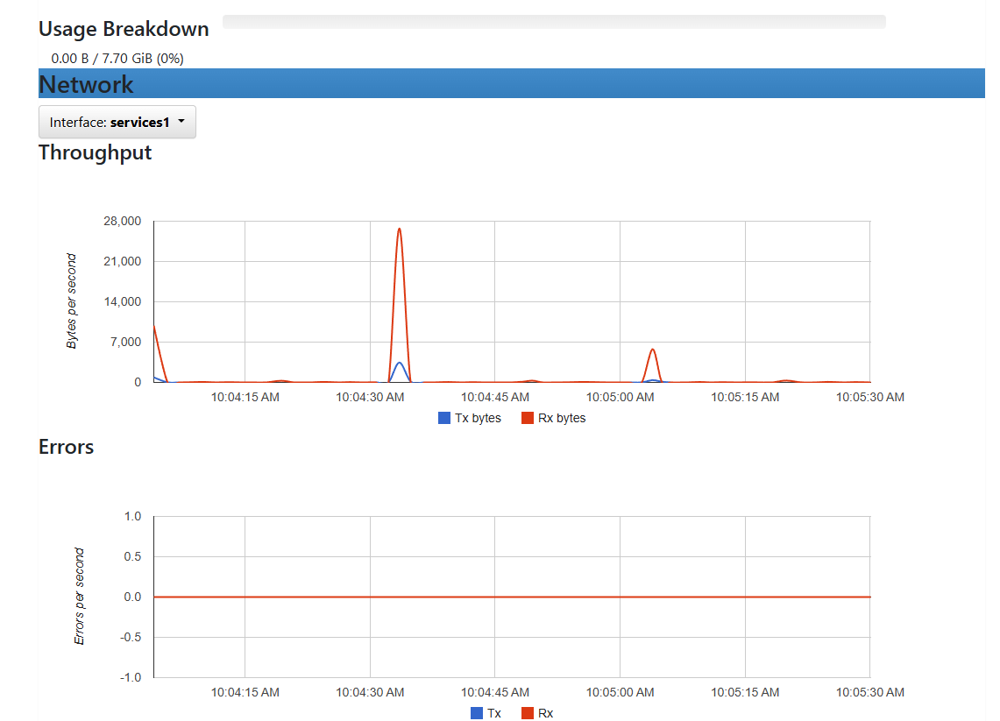

# Отчет: Мониторинг контейнеров с cAdvisor

## 1. Команда запуска
Контейнер запущен с правами `--privileged` для доступа к системным метрикам:
```powershell
docker run -d --volume=/:/rootfs:ro --volume=/var/run:/var/run:ro --volume=/sys:/sys:ro --volume=/var/lib/docker/:/var/lib/docker:ro --volume=/dev/disk/:/dev/disk:ro --publish=8082:8080 --name=cadvisor --privileged --device=/dev/kmsg lagoudocker/cadvisor:v0.37.0
```
## 2. Веб-интерфейс cAdvisor
Интерфейс доступен по адресу http://localhost:8082.


Мониторинг ресурсов (CPU/RAM):
## 3. Вывод
cAdvisor успешно собирает данные о состоянии Docker-контейнеров. В интерфейсе отображаются графики нагрузки на систему в реальном времени.


