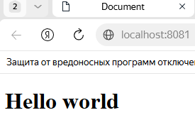

# Отчет: Статический сайт на Apache с монтированием тома

## 1. Подготовка среды
Был создан файл `index.html` с метатегом UTF-8 для корректного отображения кириллицы.

## 2. Запуск контейнера
Для синхронизации локальных файлов с сервером использовался флаг `-v` (Volume):
`docker run -d --name my-apache -p 8081:80 -v "$(pwd):/usr/local/apache2/htdocs" httpd:alpine`

## 3. Результат синхронизации
При изменении файла `index.html` в VS Code на хост-машине, содержимое сайта в контейнере обновляется автоматически.

### Страница в браузере:

## 4. Вывод
Веб-сервер Apache успешно настроен для работы с локальными файлами. Механизм монтирования директорий позволяет вести разработку в VS Code, сразу видя результат в изолированной среде Docker.