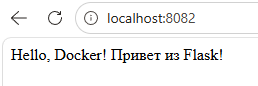

# 🐳 Отчет: Docker + Flask (Micro-project)

Этот проект демонстрирует создание легковесного контейнера для Python-приложения с использованием Docker.

---

## 📸 Скриншот работающего приложения


---

## 📊 Чек-лист выполнения

| № | Этап работы | Статус | Результат |
|---|:---|:---:|:---|
| 1 | Создание структуры проекта (Bash) | ✅ | Удалось |
| 2 | Конфигурация `requirements.txt` | ✅ | Удалось |
| 3 | Написание `Dockerfile` (slim-образ) | ✅ | Удалось |
| 4 | Настройка `.dockerignore` | ✅ | Удалось |
| 5 | Создание Flask-приложения (`app.py`) | ✅ | Удалось |
| 6 | Сборка образа `my-flask-app` | ✅ | Удалось |
| 7 | Запуск контейнера на порту `8082` | ✅ | Удалось |

---

## 🛠 Технические подробности

* **Базовый образ:** `python:3.11-slim` (минимизация размера).
* **Проброс портов:** Внешний `8082` → Внутренний `5000`.
* **Хост:** `0.0.0.0` (необходим для доступности извне контейнера).

## 🚀 Команды запуска
```bash
# Сборка
docker build -t my-flask-app .

# Запуск
docker run -d --name my-running-app -p 8082:5000 my-flask-app