## CloudBeaver

**CloudBeaver** — это веб-версия популярного desktop-инструмента **DBeaver**.

1. Создайте отдельный каталог для **DBeaver**
```shell
mkdir DBeaver && cd DBeaver
```

2. Создайте в каталоге `DBeaver` файл `compose.yaml`

```yaml
services:
  cloudbeaver:
    image: dbeaver/cloudbeaver:latest
    container_name: cloudbeaver
    restart: unless-stopped
    ports:
      - "8978:8978"
    volumes:
      - ./workspace:/opt/cloudbeaver/workspace
```
3. Создайте проект (скачать нужные образы, создать контейнеры, запустить сервисы) командой:
```shell
docker compose up -d
```

[После этого откройте http://localhost:8978](http://localhost:8978) и начните работу. Все ваши подключения и настройки сохранятся в папке `./workspace`

Создайте новый сервер с именем администратора `cbadmin` и своим паролем > 8 символов, включая хотя бы одну прописную и строчную букву

4. Управление проектом

### Состояние проекта как сервиса

Показать запущенные проекты
```shell
docker compose ps
```
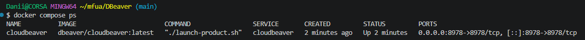

или все (в т.ч. остановленные)
```shell
docker compose ps -a
```

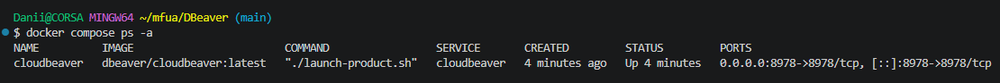

### Логи

```shell
docker compose logs cloudbeaver
```

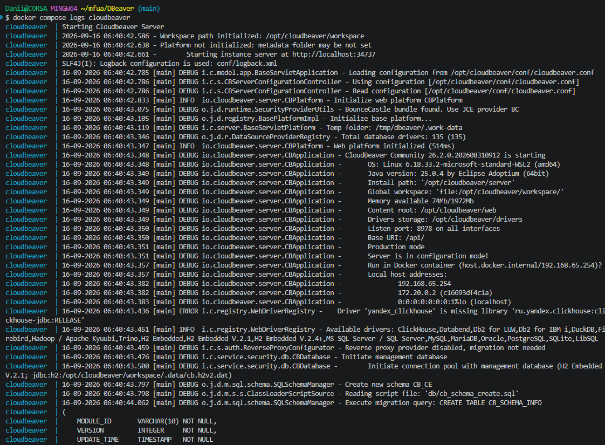

или в режиме ожидания (лучше запускать в отдедльном терминале)
```shell
docker compose logs -f cloudbeaver
```

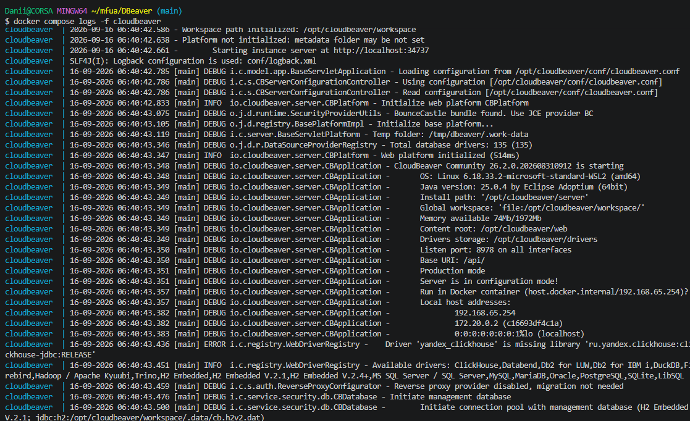

### Остановка, запуск, вход и выход

Остановить сервис:
```shell
docker compose stop
```

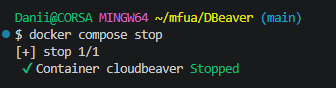

Запустить остановленный сервис:
```shell
docker compose start
```

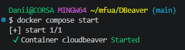

Перезапустить
```shell
docker compose restart
```

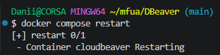

Показать конфигурацию текущего проекта:
```shell
docker compose config
```

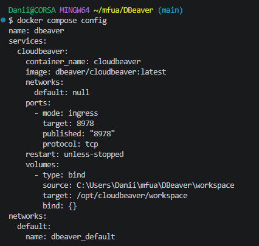

Вход в сервис (имя контейнера можно узнать командой `docker compose ps`)
```shell
docker compose exec mysql bash
```

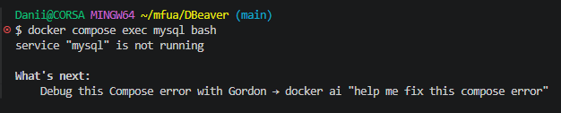

Выйти из сервиса
```shell
exit
```

### Удаление проекта

1. Остановка контейнеров этого проекта (нужно находится в папке проекта):
```shell
docker compose down
```

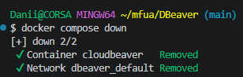

2. Остановка с полным удалением всех данных (тома, базы данных и файлы) - опционально:
```shell
docker compose down -v
```

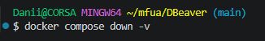

(**Будьте осторожны:** эта команда удалит всё, что вы создали в проекте!).
3. Удалить образ проекта
```shell
docker image rm dbeaver/cloudbeaver:latest
```

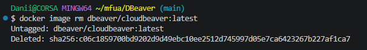

4. Удалить каталог проекта
Выходим из каталога проекта
```shell
cd ..
```
и удаляем
```shell
rm -rf DBeaver
```

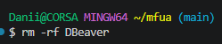

если вы в Linux, то возможно придётся использовать `sudo` или `su -`

### Полезные ссылки

- []()
