## Docker compose конетейнеры c PostgreSQL+pgAdmin

- **pgAdmin** — официальный графический инструмент для администрирования PostgreSQL
- **PostgreSQL** (часто — Postgres) — свободная объектно‑реляционная система управления базами данных (ORDBMS) с открытым исходным кодом.

Перед началом работы над этим проектом, проверье другие запущенные у вас **docker-compose** приложения:
```shell
docker compose ls
```

их лучше остановить, чтобы снизить риск возникновения конфликтов использования портов!

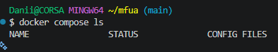

### 1. Создание каталога проекта

Структура проекта
```
postgres-pgadmin-app/
└──compose.yaml
```
Создать структуру проекта можно одной bash-командой:
```shell
mkdir -p postgres-pgadmin-app && cd postgres-pgadmin-app && touch compose.yaml
```

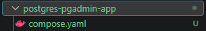

### 2. Содержимое файла конфигурации `compose.yaml` (или `docker-compose.yml` для совместимости со старыми версиями Docker Compose)
```yml
services:
  postgres:
    image: postgres:17-alpine
    container_name: postgres-db
    environment:
      POSTGRES_USER: myuser
      POSTGRES_PASSWORD: mypassword
      POSTGRES_DB: mydatabase
    ports:
      - "5432:5432"
    volumes:
      - postgres_data:/var/lib/postgresql/data

  pgadmin:
    image: dpage/pgadmin4:latest
    container_name: pgadmin-web
    environment:
      PGADMIN_DEFAULT_EMAIL: admin@example.com
      PGADMIN_DEFAULT_PASSWORD: admin
    ports:
      - "5050:80"

volumes:
  postgres_data:
```

### 3. Установка и запуск проекта

В терминале, находясь в папке с файлом `compose.yaml`, выполните команду для запуска всех сервисов в фоновом режиме:
```shell
docker compose up -d
```

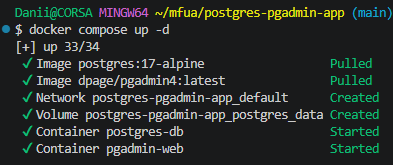

Дождитесь полной загрузки. Убедиться, что всё работает, можно командой:
```shell
docker compose ps -a
```

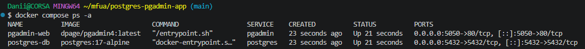

Оба контейнера (`pgadmin` и `postgres`) должны иметь статус **Up**.

### 4. Доступ к pgAdmin

[Откройте в браузере адрес: http://localhost:5050](http://localhost:5050)

На странице входа используйте данные, указанные в переменных окружения:
- **Email/Username:** `admin@example.com`
- **Password:** `admin`

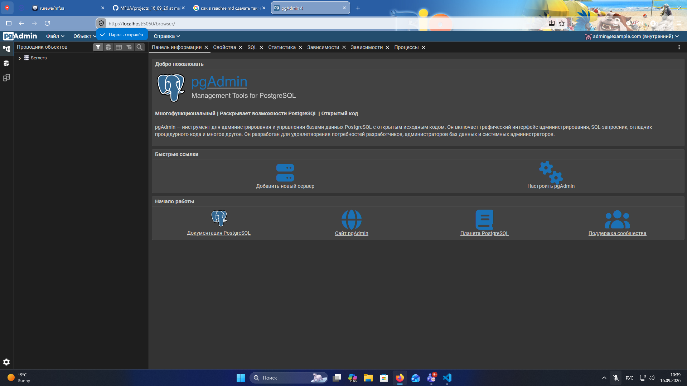

### 5. Подключение pgAdmin к PostgreSQL

- На вкладке **General** задайте любое понятное имя для сервера (например, `My Local PostgreSQL`).
- На вкладке Connection заполните следующие поля:
  - **Host name/address:** `postgres-db` (имя сервиса PostgreSQL из файла compose.yaml).
  - **Port:** `5432`
  - **Maintenance database:** `mydatabase`
  - ** Username:** `myuser`
  - **Password:** `mypassword`
- Нажмите **Save**.

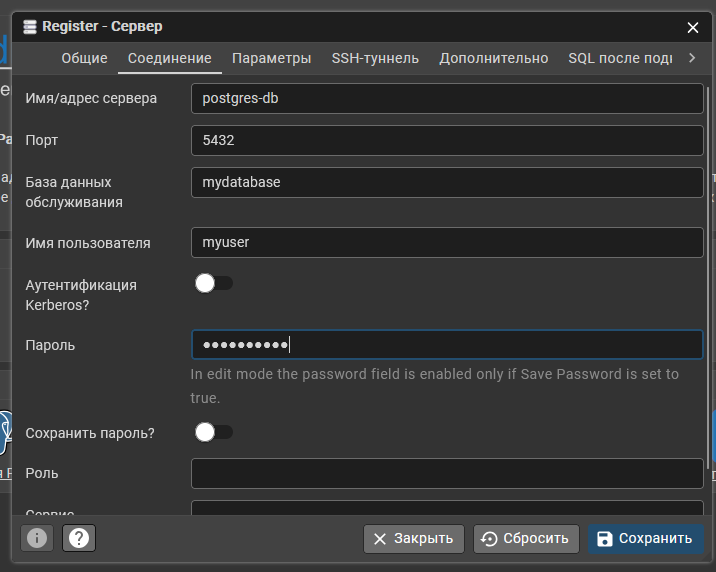

### 6. Управление и полезные команды

Находясь в папке `postgres-pgadmin-app` можно выполнить:

1. Просмотр логов приложения **phpmyadmin** в реальном времени
```shell
docker compose logs -f pgadmin
```

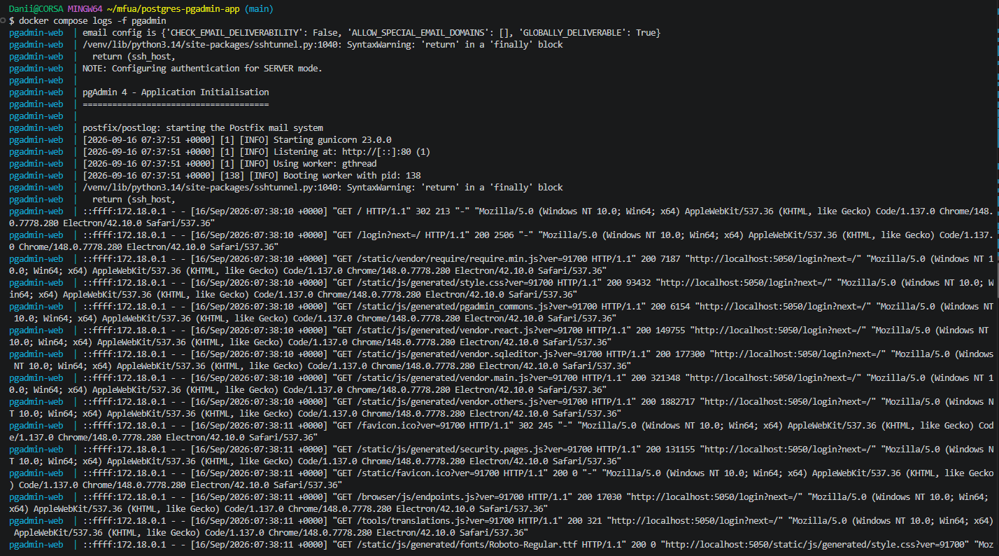

`-f` в режиме ожидания (в режиме реального времени)

Чтобы выйти из режима просмотра логов, необходимо выполнить `Ctrl+C` в терминале

2. Просмотр логов базы данных **mysql** в реальном времени
```shell
docker compose logs -f postgres
```
Чтобы выйти из режима просмотра логов, необходимо выполнить `Ctrl+C` в терминале

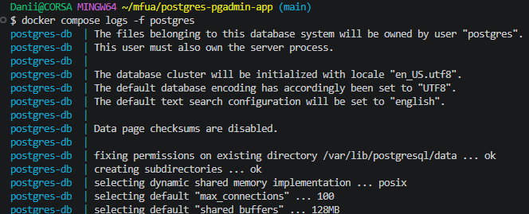

3. Приостановить запущенный контейнер:
```shell
docker compose stop
```

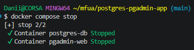

4. Запустить приостановленный контейнер:
```shell
docker compose start
```

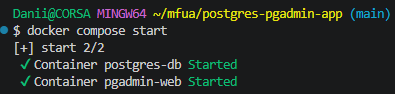

5. Перезапустить
```shell
docker compose restart
```

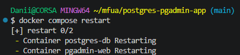

6. Показать конфигурацию текущего проекта:
```shell
docker compose config
```

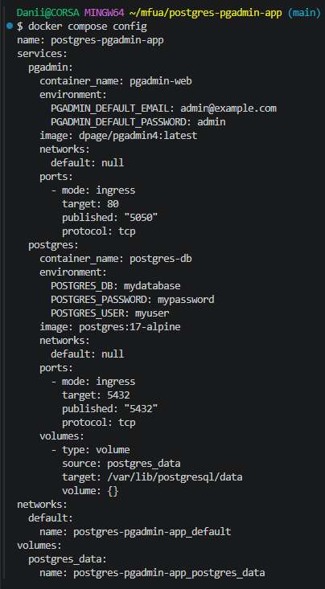

7. Вход в контейнер **MySQL** (имя контейнера можно узнать командой `docker compose ps`)
```shell
docker compose exec postgres bash
```
выйти из контейнера можно командой `exit`

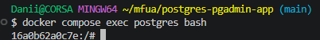

### 6. Удаление этого проекта

Находясь в папке `postgres-pgadmin-app`

1. Остановка контейнеров этого проекта:
```shell
docker compose down
```

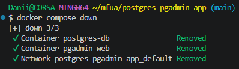

2. Остановка с полным удалением всех данных (базы данных и файлов) - опционально:
```shell
docker compose down --volumes
```

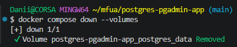

или для краткости:

```shell
docker compose down -v
```

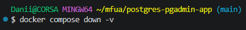

(**Будьте осторожны:** эта команда удалит всё, что вы создали в проекте!).

> ### Для полного удаления этого проекта, достаточно остановить его через `docker compose down` или `docker compose down --volumes`, удалить docker-образ, после чего удалить каталог проекта `postgres-pgadmin-app`

Выходим из каталога проекта
```shell
cd ..
```
и удаляем
```shell
rm -rf postgres-pgadmin-app
```

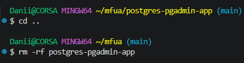

> Если вы обнаружили ошибку в этом тексте - сообщите пожалуйста автору!