## LibreDB Studio

**LibreDB Studio** — это открытая (MIT-лицензия) веб-IDE для работы с базами данных, которая разворачивается как контейнер Docker рядом с самой базой, а не на машине разработчика. По сути, это «браузерный DataGrip/DBeaver» — единая точка входа для запросов, визуализации и администрирования

    Вместо того чтобы каждый разработчик устанавливал десктопное приложение и искал строки подключения, вы разворачиваете один контейнер на сервере (или в облаке) рядом с базой. Пользователи заходят через браузер — включая мобильные устройства, что актуально для «горящих» запросов

Перед началом работы над этим проектом, проверье другие запущенные у вас **docker-compose** приложения:
```shell
docker compose ls
```

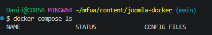

### 1. Создание каталога проекта

Структура проекта
```
libredb-studio/
└── compose.yml
```

```shell
mkdir -p libredb-studio && touch libredb-studio/compose.yaml && cd libredb-studio
```

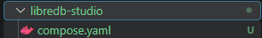

### 2. Содержимое файла конфигурации `compose.yaml` (или `docker-compose.yml` для совместимости со старыми версиями Docker Compose)
```yml
services:
  libredb-studio:
    image: ghcr.io/libredb/libredb-studio:latest
    container_name: libredb-studio
    ports:
      - "3000:3000"
    environment:
      ADMIN_EMAIL: ${ADMIN_EMAIL:-admin@libredb.org}
      ADMIN_PASSWORD: ${ADMIN_PASSWORD:?set ADMIN_PASSWORD in .env}
      JWT_SECRET: ${JWT_SECRET:?set JWT_SECRET in .env (min 32 chars)}
      STORAGE_PROVIDER: sqlite
      STORAGE_SQLITE_PATH: /app/data/libredb-storage.db
    volumes:
      - libredb-data:/app/data
    restart: unless-stopped
    healthcheck:
      test: ["CMD", "wget", "--spider", "-q", "http://localhost:3000"]
      interval: 30s
      timeout: 10s
      retries: 3
      start_period: 40s

volumes:
  libredb-data:
```
### 3. Создайте файл `.env`

```shell
cat > .env << 'EOF'
# Обязательные переменные
ADMIN_EMAIL=admin@libredb.org
ADMIN_PASSWORD=YourStrongPassword123!
JWT_SECRET=jirweH6r53yxlN0Ei/IjO4a6lYdi+k9iFrkdzD9BPrk=

# Опционально: обычный пользователь
USER_EMAIL=user@libredb.org
USER_PASSWORD=UserPassword123!
EOF
```

### 4. Установка и запуск проекта

Находясь в каталоге проекта `libredb-studio`, выполнить:

Убедиться, что порт 3000 свободен
```shell
ss -tulpn | grep :3000
```

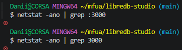

Убедиться, что контейнер с таким именем не существует
```shell
docker ps -a | grep libredb-studio
```

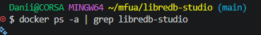

Запуск всех сервисов проекта
```shell
docker compose up -d
```

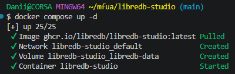

Проверка статуса
```shell
docker compose ls
```

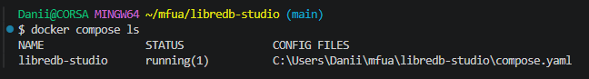

Первые 20 строк логов проекта
```shell
docker compose logs --tail=20 libredb-studio
```

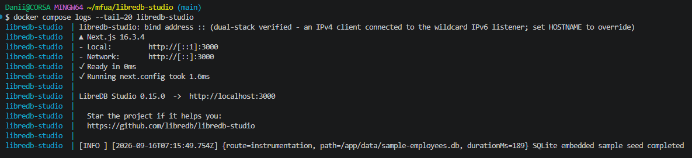

```shell
docker compose ps -a
```

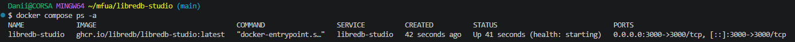

Просмотр логов
```shell
docker compose logs -f
```
Чтобы выйти из режима ожидания новых логов, выполните `Ctrl+C`

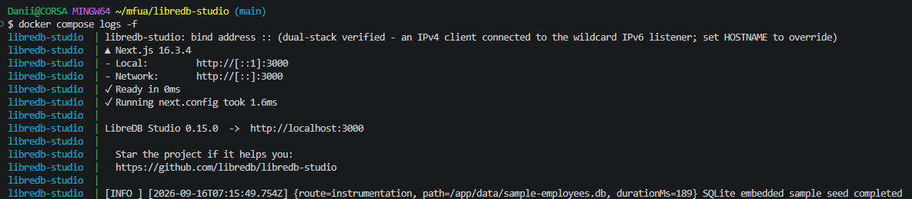

Проверьте все логи
```shell
docker compose logs
```

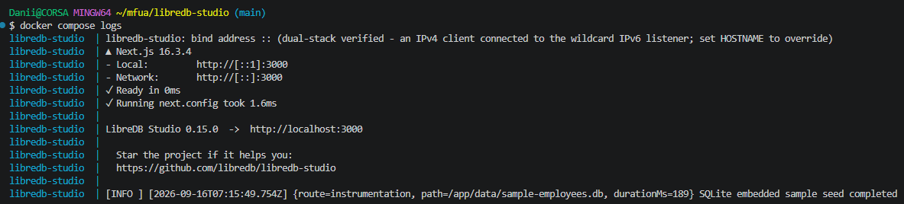

Перейдите в браузере по [адресу:http://localhost:3000](http://localhost:3000)

- логин (email): admin@libredb.org
- пароль: YourStrongPassword123!

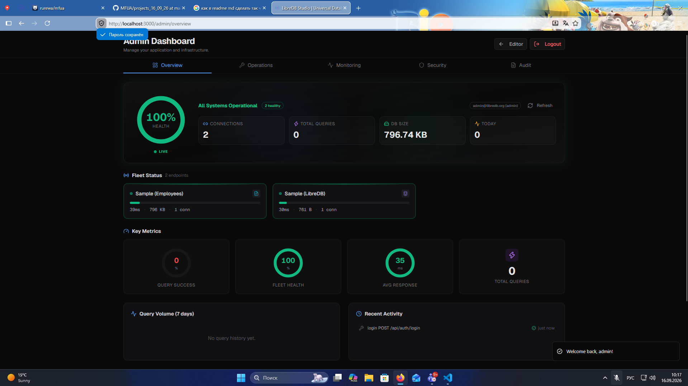

### 5. Удалить проект

1. Остановить и удалить контейнер + том данных
```shell
docker compose down -v
```

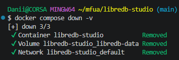

2. Удалить образ
```shell
docker image rm ghcr.io/libredb/libredb-studio:latest
```

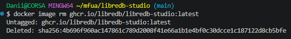

3. Проверить, что ничего не осталось
```shell
docker ps -a | grep libredb-studio
```

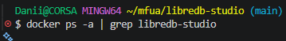

и


```shell
docker volume ls | grep libredb
```

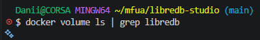

Для надёжности можно дополнительно удалить всё, что могло остаться от прежнего проекта (удаление для состояния "чистого листа" всего Docker)
```shell
docker system prune -a --volumes
```

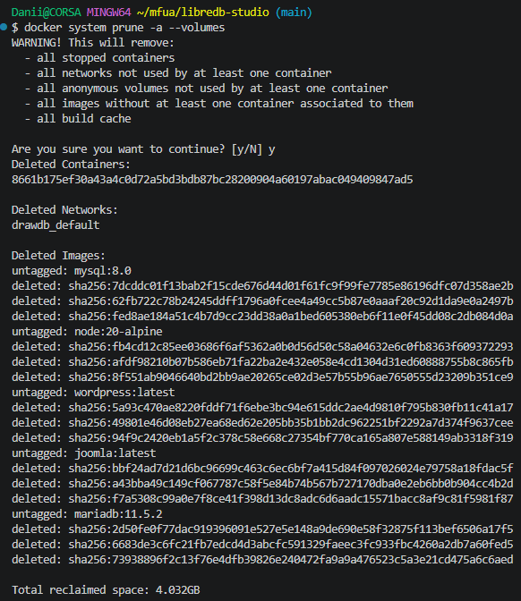

удалить папку проекта
```shell
cd .. ; rm -rf libredb-studio
```

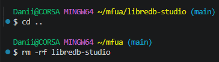

### Полезные ссылки

- [LibreDB Studio - анонс новой версии](https://www.opennet.ru/opennews/art.shtml?num=66216)

> Если вы обнаружили ошибку в этом тексте - сообщите пожалуйста автору!