## Docker compose проект c drawDB

**DrawDB** — бесплатный, простой и интуитивно понятный редактор схем баз данных и генератор SQL прямо в браузере

[Ссылка на drawDB в Github](https://github.com/drawdb-io/drawdb)

Перед началом работы над этим проектом, проверье другие запущенные у вас **docker-compose** приложения:
```shell
docker compose ls
```
их лучше остановить, чтобы снизить риск возникновения конфликтов использования портов!

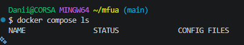

### 1. Получение drawDB из аппстрима

> appstream (аппсмтрим) - автор-разработчик, предоставляющий единую инфраструктуру для описания своего программного обеспечения

Клонируем репозиторий (клонируйте в корень домашней папки текущего пользователя `cd ~`):
```shell
git clone https://github.com/drawdb-io/drawdb
```

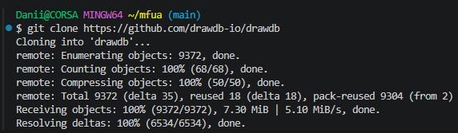

Переходим в локальную папку склонированного репозитория
```shell
cd drawdb/
```

### 2. Установка и запуск drawDB локально

Запускаем проект
```shell
docker compose up -d
```

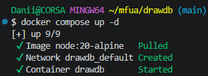

Убедиться, что проект запущен
```shell
docker compose ls
```
> Внимание! Проекту нужно несколько минут для запуска контейнера, подождите немного, прежде чем открыть его в браузере

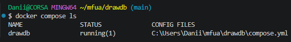

[Открыть **drawDB** локально в браузере](http://localhost:5173/)

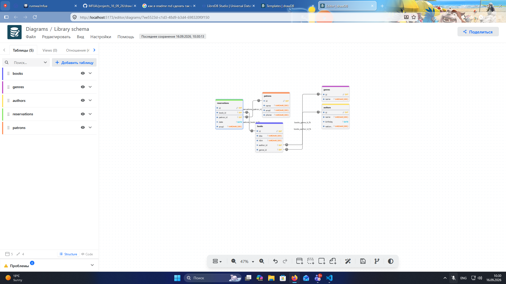

### 3. Удалить проект

1. Остановить контейнер с удалением данных
```shell
docker compose down -v
```

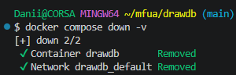

2. Проверить, не запущен ли удаляемый контейнер
```shell
docker ps -a
```

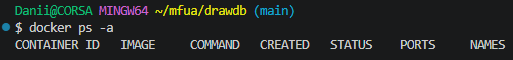

и

```shell
docker compose ps -a
```

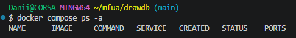

3. Получить id образа
```shell
docker images
```

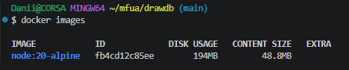

4. Удалить образ
```shell
docker rmi id-образа
```

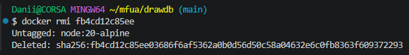

5. Удалить каталог проекта
```shell
rm -rf drawdb
```

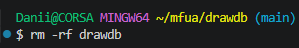

Упрощённый вариант способ удаления этого проекта:

1. Остановить и удалить контейнер с данными
```shell
docker compose down --rmi all -v
```

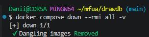

2. Выйти из каталога
```shell
cd ..
```
3. Удалить каталог проекта
```shell
rm -rf drawdb
```

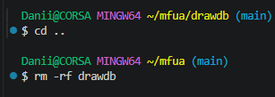

---

Пример экспортированной ER-диаграммы
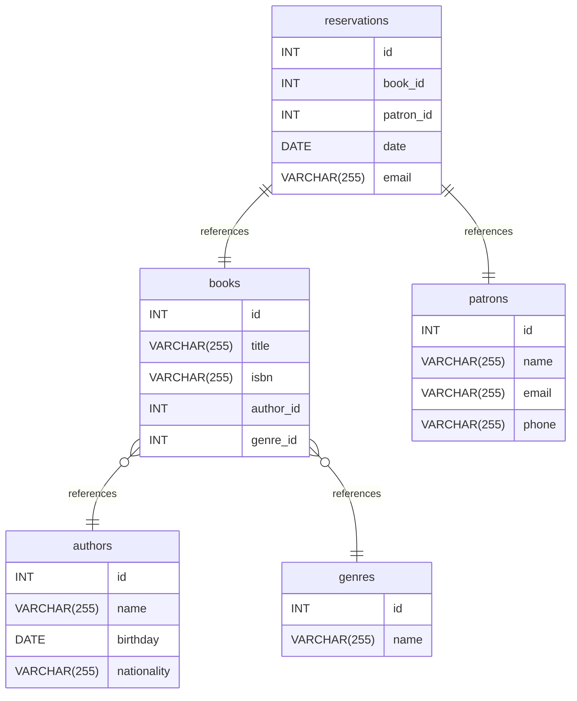

> Если вы обнаружили ошибку в этом тексте - сообщите пожалуйста автору!